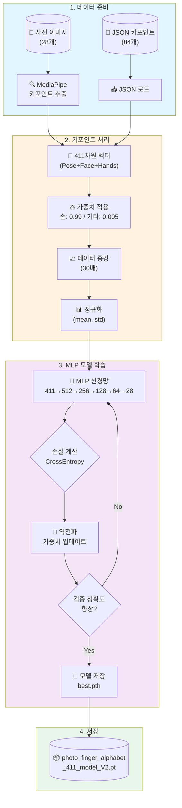
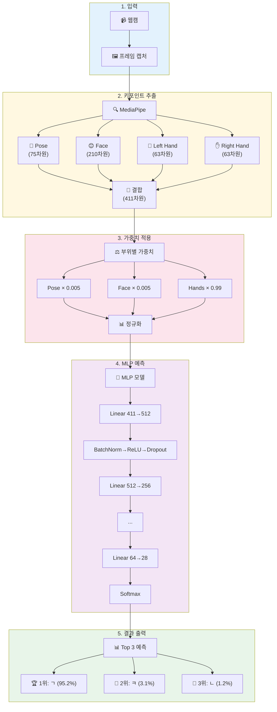
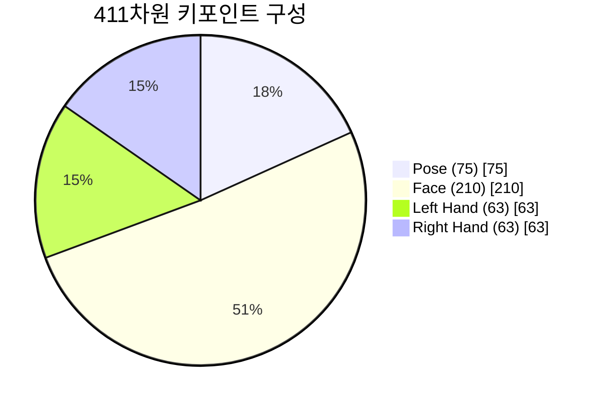
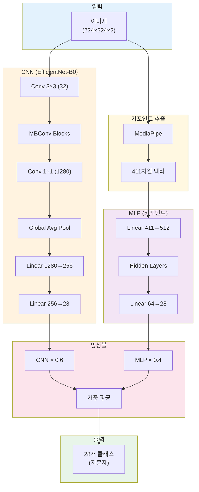

# 사진 지문자 인식 모델 (photo_finger_alphabet.ipynb)

## 모델 개요

사진 또는 실시간 카메라에서 한글 지문자(ㄱ,ㄴ,ㄷ,...,ㅏ,ㅓ,ㅗ,...)를 인식하는 모델입니다.

### 입력/출력

| 항목 | 내용 |
|------|------|
| 입력 | 사진 이미지 또는 실시간 카메라 프레임 |
| 출력 | 지문자 클래스 (28개: 자음 14개 + 모음 14개) |
| 데이터 경로 | `/Users/garyeong/project-1/사진_지문자/` |

### 키포인트 구조 (411차원)

기존 영상 모델과 동일한 구조를 사용합니다.

| 부위 | 랜드마크 수 | 차원 |
|------|------------|------|
| Pose (몸) | 25개 × 3 (x, y, visibility) | 75 |
| Face (얼굴) | 70개 × 3 (x, y, z) | 210 |
| Left Hand | 21개 × 3 (x, y, z) | 63 |
| Right Hand | 21개 × 3 (x, y, z) | 63 |
| **Total** | | **411** |

### 부위별 가중치

지문자 인식에서 손이 가장 중요하므로 가중치를 차등 적용합니다.

| 부위 | 가중치 |
|------|--------|
| Pose (몸) | 0.005 |
| Face (얼굴) | 0.005 |
| Hands (손) | **0.99** |

---

## 전체 파이프라인 플로우차트

### 학습 과정 (Training Pipeline)



### 실시간 인식 과정 (Inference Pipeline)



### MLP 모델 상세 구조

```mermaid
flowchart LR
    subgraph Input["입력층"]
        I["411 뉴런<br/>(키포인트)"]
    end

    subgraph Hidden1["은닉층 1"]
        H1L["Linear<br/>411→512"]
        H1B["BatchNorm"]
        H1R["ReLU"]
        H1D["Dropout<br/>0.3"]
        H1L --> H1B --> H1R --> H1D
    end

    subgraph Hidden2["은닉층 2"]
        H2L["Linear<br/>512→256"]
        H2B["BatchNorm"]
        H2R["ReLU"]
        H2D["Dropout<br/>0.3"]
        H2L --> H2B --> H2R --> H2D
    end

    subgraph Hidden3["은닉층 3"]
        H3L["Linear<br/>256→128"]
        H3B["BatchNorm"]
        H3R["ReLU"]
        H3D["Dropout<br/>0.3"]
        H3L --> H3B --> H3R --> H3D
    end

    subgraph Hidden4["은닉층 4"]
        H4L["Linear<br/>128→64"]
        H4B["BatchNorm"]
        H4R["ReLU"]
        H4D["Dropout<br/>0.3"]
        H4L --> H4B --> H4R --> H4D
    end

    subgraph Output["출력층"]
        O["Linear<br/>64→28"]
        S["Softmax"]
        O --> S
    end

    I --> H1L
    H1D --> H2L
    H2D --> H3L
    H3D --> H4L
    H4D --> O

    style Input fill:#e3f2fd
    style Hidden1 fill:#fff3e0
    style Hidden2 fill:#fff3e0
    style Hidden3 fill:#fff3e0
    style Hidden4 fill:#fff3e0
    style Output fill:#e8f5e9
```



### 키포인트 구조 (411차원)



### CNN 및 앙상블 모델 구조



---

## 딥러닝 모델 개념 설명

### MLP (Multi-Layer Perceptron) - 다층 퍼셉트론

#### MLP란?

MLP는 가장 기본적인 신경망 구조로, **완전 연결 신경망(Fully Connected Neural Network)**이라고도 합니다. 입력층, 은닉층, 출력층으로 구성되며, 각 층의 모든 뉴런이 다음 층의 모든 뉴런과 연결됩니다.

```
[입력층]     [은닉층1]    [은닉층2]    [출력층]
  ○────────○────────○────────○
  ○───╲╱───○───╲╱───○───╲╱───○
  ○────────○────────○────────○
  ○────────○────────○
```

#### MLP의 작동 원리

1. **순전파 (Forward Propagation)**
   - 입력 데이터가 각 층을 통과하며 계산됨
   - 각 뉴런은 `출력 = 활성화함수(가중치 × 입력 + 편향)` 계산

2. **활성화 함수 (Activation Function)**
   - 비선형성을 추가하여 복잡한 패턴 학습 가능
   - ReLU: `f(x) = max(0, x)` - 음수는 0, 양수는 그대로

3. **역전파 (Back Propagation)**
   - 예측값과 실제값의 차이(손실)를 계산
   - 손실을 줄이는 방향으로 가중치 업데이트

#### 본 프로젝트의 MLP 구조

```
Input (411) → Linear(512) → BatchNorm → ReLU → Dropout(0.3)
           → Linear(256) → BatchNorm → ReLU → Dropout(0.3)
           → Linear(128) → BatchNorm → ReLU → Dropout(0.3)
           → Linear(64)  → BatchNorm → ReLU → Dropout(0.3)
           → Linear(28)  → Output
```

| 구성 요소 | 역할 |
|----------|------|
| **Linear** | 선형 변환 (가중치 행렬 곱셈 + 편향) |
| **BatchNorm** | 배치 정규화 - 학습 안정화, 수렴 속도 향상 |
| **ReLU** | 활성화 함수 - 비선형성 추가 |
| **Dropout(0.3)** | 30% 뉴런 무작위 비활성화 - 과적합 방지 |

#### MLP가 지문자 인식에 적합한 이유

| 장점 | 설명 |
|------|------|
| 경량화 | 411차원 벡터만 처리하므로 연산량이 적음 |
| 빠른 추론 | 단순한 행렬 연산으로 실시간 처리 가능 |
| 해석 가능 | 어떤 키포인트가 중요한지 분석 가능 |
| 작은 데이터 | 이미지 CNN보다 적은 데이터로 학습 가능 |

---

### CNN (Convolutional Neural Network) - 합성곱 신경망

#### CNN이란?

CNN은 이미지 인식에 특화된 신경망으로, **합성곱(Convolution)** 연산을 통해 이미지의 공간적 특징을 추출합니다. 사람의 시각 피질 구조에서 영감을 받아 설계되었습니다.

#### CNN의 핵심 구성 요소

```
[입력 이미지]
    ↓
[합성곱층] ← 필터가 이미지를 스캔하며 특징 추출
    ↓
[풀링층] ← 크기 축소, 중요 특징 유지
    ↓
[합성곱층] ← 더 복잡한 특징 추출
    ↓
[풀링층]
    ↓
[완전연결층] ← 분류 수행
    ↓
[출력]
```

#### 1. 합성곱 층 (Convolutional Layer)

작은 필터(커널)가 이미지 위를 이동하며 특징을 추출합니다.

```
입력 이미지 (5×5)          필터 (3×3)           출력 특징맵 (3×3)
┌─────────────────┐     ┌─────────┐         ┌─────────────┐
│ 1  2  3  4  5   │     │ 1  0  1 │         │ 특징값들...  │
│ 6  7  8  9  10  │  *  │ 0  1  0 │    =    │             │
│ 11 12 13 14 15  │     │ 1  0  1 │         │             │
│ 16 17 18 19 20  │     └─────────┘         └─────────────┘
│ 21 22 23 24 25  │
└─────────────────┘
```

**특징 추출 예시:**
- 초기 층: 가장자리, 색상, 질감 등 저수준 특징
- 중간 층: 모양, 패턴 등 중간 수준 특징
- 깊은 층: 손가락, 손 모양 등 고수준 특징

#### 2. 풀링 층 (Pooling Layer)

특징맵의 크기를 줄여 연산량 감소 및 위치 불변성 확보

```
Max Pooling (2×2)
┌─────────┐        ┌─────┐
│ 1  3    │        │     │
│ 5  6    │   →    │  6  │  ← 영역 내 최대값 선택
└─────────┘        └─────┘
```

#### 3. 완전연결 층 (Fully Connected Layer)

추출된 특징을 바탕으로 최종 분류 수행

#### 본 프로젝트의 CNN 구조 (EfficientNet-B0)

```
Input Image (224×224×3)
        ↓
[EfficientNet-B0 Backbone] ← ImageNet 사전학습 가중치 사용
        ↓
Feature Vector (1280차원)
        ↓
Linear(1280 → 256) → ReLU → Dropout
        ↓
Linear(256 → 28) → Output
```

**EfficientNet의 특징:**
- 모델 크기, 해상도, 깊이를 균형있게 스케일링
- 같은 정확도 대비 적은 파라미터 수
- MBConv 블록 사용 (Mobile Inverted Bottleneck)

#### MLP vs CNN 비교

| 항목 | MLP (키포인트) | CNN (이미지) |
|------|---------------|--------------|
| 입력 | 411차원 벡터 | 224×224×3 이미지 |
| 파라미터 수 | ~30만개 | ~400만개 |
| 추론 속도 | 매우 빠름 | 보통 |
| 필요 데이터 | 적음 | 많음 |
| 배경 영향 | 없음 | 있음 |
| GPU 필요성 | 낮음 | 높음 |

---

## 모델 구조

### 1. 키포인트 분류 모델 (MLP)

MediaPipe로 추출한 411차원 키포인트를 분류합니다.

```
Input (411) → 512 → 256 → 128 → 64 → Output (28)
```

- BatchNorm + ReLU + Dropout(0.3) 적용
- 저장 파일: `model_keypoint_411_best.pth`

### 2. CNN 이미지 분류 모델

원본 이미지를 직접 분류합니다.

```
EfficientNet-B0 (pretrained) → 1280 → 256 → Output (28)
```

- 저장 파일: `model_cnn_best.pth`

### 3. 앙상블 모델

두 모델의 예측을 가중 평균하여 최종 예측합니다.

| 모델 | 가중치 |
|------|--------|
| 키포인트 MLP | 0.4 |
| CNN EfficientNet | 0.6 |

---

## 데이터 증강

데이터가 적으므로(클래스당 1장) 30배 증강을 적용합니다.

| 증강 기법 | 설명 |
|----------|------|
| 노이즈 | 가우시안 노이즈 (σ=0.015) |
| 스케일 | 0.95 ~ 1.05 배율 |
| 회전 | -10° ~ +10° 2D 회전 |

---

## 저장된 모델 파일

| 파일명 | 내용 |
|--------|------|
| `photo_finger_alphabet_411_model_V2.pt` | 전체 모델 (키포인트 + 정규화 파라미터 + 라벨 매핑) |
| `model_keypoint_411_best_V2.pth` | 키포인트 MLP 모델 가중치 |
| `model_cnn_best.pth` | CNN 모델 가중치 |

---

## 실행 방법

### 환경 설정

```bash
# 1. 터미널에서 conda 가상환경 활성화
conda activate py311_env

# 2. 필요한 패키지 확인 (이미 설치되어 있어야 함)
pip list | grep -E "torch|mediapipe|opencv"
```

### 모델 학습

```bash
# 1. 가상환경 활성화
conda activate py311_env

# 2. 모델 디렉토리로 이동
cd 경로명 

# 3. 학습 스크립트 실행
python run_training.py
```

**학습 과정 출력 예시:**
```
사용 디바이스: mps
키포인트 차원: 411
손 가중치: 0.99

==================================================
1. 데이터 로드
==================================================
기존 이미지 데이터: 28개
JSON keypoints 데이터: 84개 (3개 각도)
클래스 수: 28
...
```

### 실시간 인식 실행

```bash
# 1. 가상환경 활성화
conda activate py311_env

# 2. 모델 디렉토리로 이동
cd /Users/garyeong/project-1/morpheme/photo_model

# 3. 실시간 인식 스크립트 실행
python realtime_recognition.py
```

**실행 시 화면:**
- 웹캠이 자동으로 켜집니다
- 손을 카메라에 보여주면 Top 3 예측 결과가 표시됩니다
- 종료: `q` 키

**실시간 인식 출력 예시:**
```
디바이스: mps
모델 로드 중...
클래스 수: 28
라벨: ['ㄱ', 'ㄴ', 'ㄷ', ...]

==================================================
실시간 지문자 인식 시작
종료: 'q' 키
==================================================
```

### 단일 이미지 예측

```python
# Jupyter 노트북 또는 Python 스크립트에서
predict_single_image(image_path, use_ensemble=True)
```

### 실시간 인식 (코드에서 직접 사용)

```python
recognizer = RealTimeFingerAlphabetRecognizer(...)
predicted_label, confidence, landmarks_info = recognizer.predict(frame, use_ensemble=True)
```

---

# 지문자 인식 모델 개발 방향 의견

## 현재 상황

| 항목 | 내용 |
|------|------|
| 사진 데이터 | 28개 (클래스당 1장) |
| 모델 방식 | 키포인트 기반 (MediaPipe 411차원) |
| V1 정확도 | 약 98% |
| V2 정확도 | 약 96% |

---

## 결론: 사진 데이터 확보가 우선

**키포인트 방식을 유지하면서 사진 데이터를 늘리는 것을 권장합니다.**

---

## 이유

### 1. 현재 데이터가 너무 적음
- 클래스당 **1장**은 심각하게 부족함
- 데이터 증강(30배)으로 버티고 있지만 한계가 있음
- 실제 사용 환경의 다양성을 전혀 반영하지 못함

### 2. 키포인트 방식의 장점
| 장점 | 설명 |
|------|------|
| 경량화 | 411차원 벡터만 처리 (이미지 CNN 대비 10배+ 빠름) |
| 일반화 | 배경, 조명, 피부색에 강건함 |
| 해석 가능 | 어떤 관절이 중요한지 파악 가능 |
| 실시간성 | 노트북에서도 실시간 처리 가능 |

### 3. 순수 이미지 CNN의 단점
- 데이터가 적으면 **과적합** 심각
- 배경/조명에 민감
- 학습에 GPU 필요, 추론도 느림
- 최소 클래스당 **100장 이상** 필요

---

## 권장 데이터 수집 계획

### 최소 목표
```
클래스당 10장 이상 = 28 × 10 = 280장
```

### 이상적 목표
```
클래스당 30~50장 = 28 × 50 = 1,400장
```

### 다양성 확보 방법
1. **다른 각도** - 정면, 약간 좌/우 회전
2. **다른 거리** - 카메라 가까이/멀리
3. **다른 조명** - 밝은 곳, 어두운 곳
4. **다른 배경** - 여러 장소에서 촬영
5. **다른 사람** - 가능하면 2~3명

---

## 좌표 데이터(영상)는 언제 필요한가?

### 현재 불필요한 이유
- 지문자는 **정적 포즈**
- 동작의 시간적 흐름이 없음
- 손 모양만으로 구분 가능

### 좌표 데이터가 필요한 경우
- **수어 단어/문장** 인식 시 (동작 포함)
- 손의 **이동 경로**가 중요한 경우
- LSTM/Transformer로 시퀀스 학습 시

---

## 추천 우선순위

| 순위 | 작업 | 기대 효과 |
|------|------|----------|
| 1 | 사진 데이터 10배 확보 | 정확도 상승, 일반화 개선 |
| 2 | 다양한 사람으로 촬영 | 실사용 환경 대응 |
| 3 | 혼동되는 지문자 집중 수집 | 세부 정확도 개선 |
| 4 | (나중에) 수어 단어 인식 | 영상 좌표 데이터 활용 |

---

## 요약

```
현재: 사진 28장 + 키포인트 모델 = 98% (과적합 가능성 높음)

권장: 사진 300장+ + 키포인트 모델 = 실사용 가능한 모델

영상 좌표: 수어 문장 인식 단계에서 도입
```

**데이터가 왕이다.** 모델 구조보다 데이터 양과 다양성이 성능을 결정합니다.
